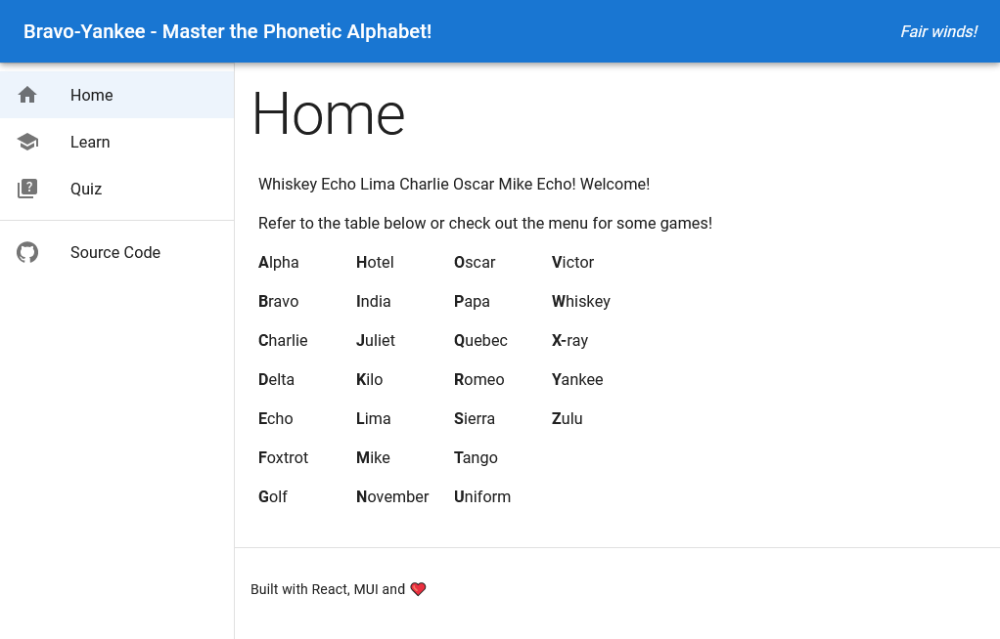
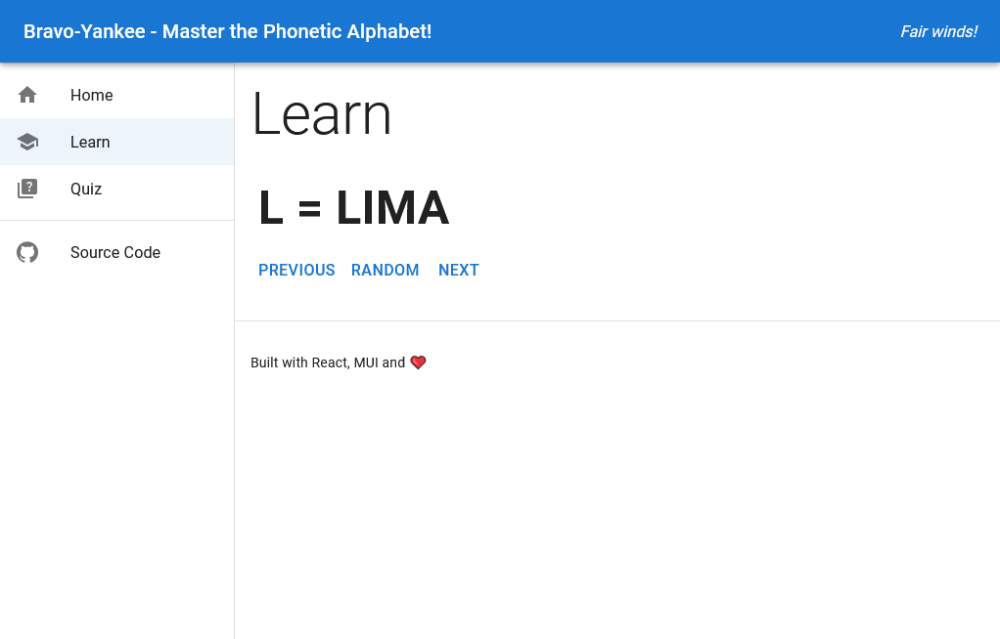
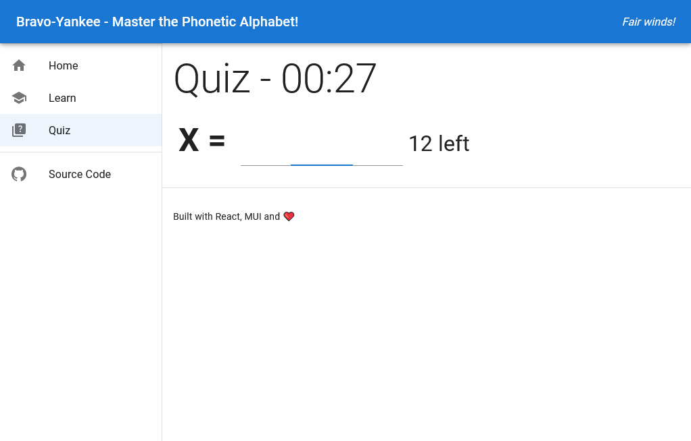

# Bravo-Yankee - Master the Phonetic Alphabet!

Another React practice. Includes a fast-paced quiz. Try it out here https://bravo-yankee.lajoscseppento.dev !

Features:

- Phonetic Alphabet table
- Interactive viewer for learning
- Timed quiz mode (random order)

## Screenshots

Home:

Learn:

Quiz:

## Developer Info

1. Clone repo
2. Execute `pnpm start`
3. ???
4. PROFIT!
